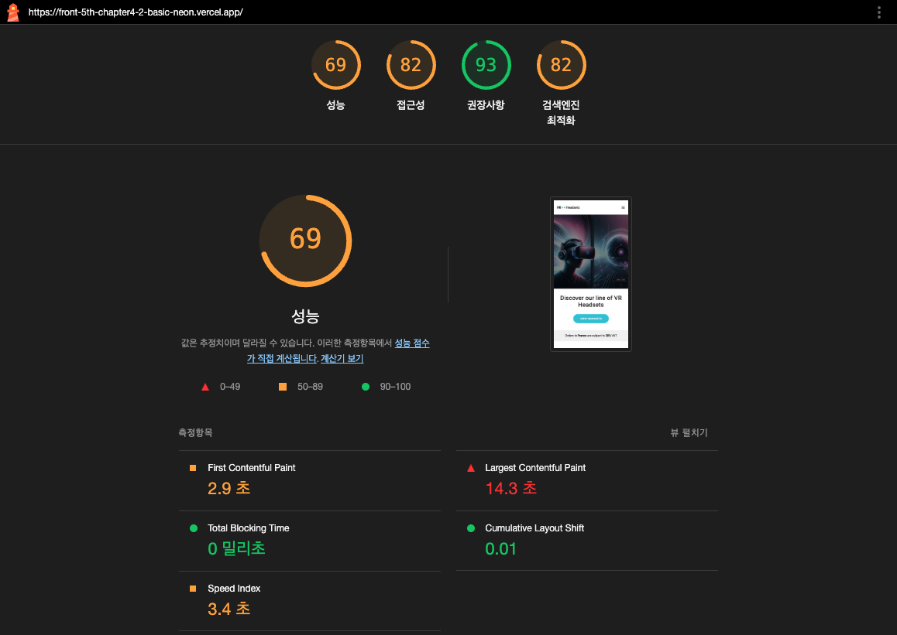
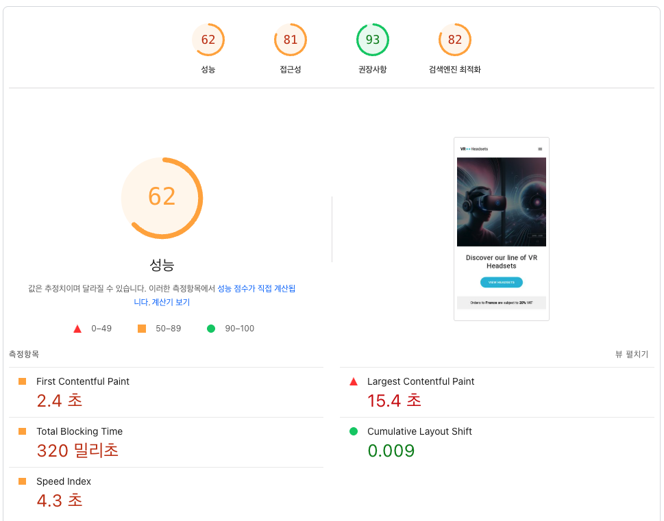

# Chapter 4-2. 코드 관점의 성능 최적화

## 목차

- [1. 학습 목표](#-1-학습-목표)
- [2. 링크](#-2-링크)
- [3. 주요 개념 정리](#-3-주요-개념-정리)
- [4. 초기 성능](#-4-초기-성능)
- [5. 성능 개선 과정 및 결과](#-5-성능-개선-과정-및-결과)
- [6. 학습 내용 정리](#-6-학습-내용-정리)
- [7. 과제 피드백](#-7-과제-피드백)

## 🎯 1. 학습 목표

🍦 바닐라 JavaScript 프로젝트를 구성/배포하고 성능 측정/개선을 진행합니다.

## 🔗 2. 링크

https://front-5th-chapter4-2-basic-neon.vercel.app/ ( Vercel 배포 )

## 📚 3. 주요 개념 정리

## 🛫 4. 초기 성능

### (1) lighthouse.yml 스크립트를 통한 검사

#### 🎯 Lighthouse 점수

| 카테고리       | 점수 | 상태 |
| -------------- | ---- | ---- |
| Performance    | 72%  | 🟠   |
| Accessibility  | 82%  | 🟠   |
| Best Practices | 75%  | 🟠   |
| SEO            | 82%  | 🟠   |
| PWA            | 0%   | 🔴   |

#### 📊 Core Web Vitals (2024)

| 메트릭 | 설명                      | 측정값 | 상태 |
| ------ | ------------------------- | ------ | ---- |
| LCP    | Largest Contentful Paint  | 14.56s | 🔴   |
| INP    | Interaction to Next Paint | N/A    | 🟢   |
| CLS    | Cumulative Layout Shift   | 0.011  | 🟢   |

#### 📝 Core Web Vitals 기준값

- **LCP (Largest Contentful Paint)**: 가장 큰 콘텐츠가 화면에 그려지는 시점

  - 🟢 Good: < 2.5s
  - 🟠 Needs Improvement: < 4.0s
  - 🔴 Poor: ≥ 4.0s

- **INP (Interaction to Next Paint)**: 사용자 상호작용에 대한 전반적인 응답성

  - 🟢 Good: < 200ms
  - 🟠 Needs Improvement: < 500ms
  - 🔴 Poor: ≥ 500ms

- **CLS (Cumulative Layout Shift)**: 페이지 로드 중 예기치 않은 레이아웃 변경의 정도
  - 🟢 Good: < 0.1
  - 🟠 Needs Improvement: < 0.25
  - 🔴 Poor: ≥ 0.25

### (2) 배포 링크를 통한 검사

#### 🎯 Lighthouse 점수



| 카테고리       | 점수 | 상태 |
| -------------- | ---- | ---- |
| Performance    | 69%  | 🟠   |
| Accessibility  | 82%  | 🟠   |
| Best Practices | 93%  | 🟢   |
| SEO            | 82%  | 🟠   |
| PWA            | 0%   | 🔴   |

❓❓ Best Practices(권장사항) 값에서 lighthouse.yml로 검사한 것과 큰 차이를 보이는 이유는 뭘까??

배포로 인해 발생하는 프로토콜, 보안 헤더, 브라우저 정책 등의 차이 때문인 것으로 보인다.

- 프로토콜 차이

  Best Practices 항목에서 HTTPS는 매우 중요한 평가 항목임.

- 보안 헤더 차이

  Vercel은 기본적으로 다음과 같은 보안 헤더들을 자동으로 설정하지만 `http-server`는 이런 것들을 제공하지 않음.

  - `X-Content-Type-Options: nosniff`
  - `X-Frame-Options: DENY`
  - `X-XSS-Protection: 1; mode=block`
  - `Referrer-Policy: origin-when-cross-origin`
  - `Strict-Transport-Security` (HSTS)

- Mixed Content 정책

  ```html
  <!-- index.html -->
  <script
    type="text/javascript"
    src="//www.freeprivacypolicy.com/public/cookie-consent/4.1.0/cookie-consent.js"
    charset="UTF-8"
  ></script>
  ```

  HTTP 환경에서는 이런 외부 스크립트들이 Mixed Content 이슈를 일으킬 수 있으나 HTTPS 환경에서는 보안 정책이 좀 더 엄격히 적용됨

- 서버 환경 차이

  - http-server: 단순한 정적 파일 서버, 최소한의 HTTP 헤더만 제공
  - Vercel: 엔터프라이즈급 CDN, 다양한 보안 최적화가 기본 적용되어있음

- 브라우저 정책 차이

  HTTPS 환경에서는 브라우저가 더 엄격한 보안 정책을 적용하며 이것이 긍정적으로 반영됨.

  - Service Worker 사용 가능
  - Secure Cookie 정책
  - CORS 정책 강화

#### 📊 PageSpeed Insights를 통한 Core Web Vitals (2024)



| 메트릭 | 설명                      | 측정값 | 상태 |
| ------ | ------------------------- | ------ | ---- |
| LCP    | Largest Contentful Paint  | 15.4s  | 🔴   |
| INP    | Interaction to Next Paint | N/A    | 🟢   |
| CLS    | Cumulative Layout Shift   | 0.01   | 🟢   |

### 개선 전 초기 성능 분석

#### 🚨 가장 심각한 문제

LCP 지표가 15초 안팎이며 일반적으로 2.5초 이내가 목표인데 거의 6배 정도가 느림

주요 원인

- Hero 이미지: `Hero_Desktop.jpg`, `Hero_Tablet.jpg`, `Hero_Mobile.jpg` 모두 동시에 로드하여 디바이스 별 적절한 이미지를 제공하고 있지 못함
- 이미지 최적화 부재: 압축되지 않은 원본 이미지 사용

#### ⚡️ Performance 점수 분석

**Javascript 실행 이슈**

```javascript
// products.js
for (let i = 0; i < 10000000; i++) {
  const temp = Math.sqrt(i) * Math.sqrt(i);
}
```

- 메인 스레드 블로킹: 불필요한 연산으로 인한 UI 렌더링 차단
- 동기식 API 호출: `fetch` 후 DOM 조작이 즉시 실행되어 렌더링이 지연됨

**렌더링 차단 리소스**

```html
<link
  href="https://fonts.googleapis.com/css?family=Heebo:300,400,600,700&display=swap"
  rel="stylesheet"
/>

<script>
  (function (w, d, s, l, i) {
    w[l] = w[l] || [];
    w[l].push({ "gtm.start": new Date().getTime(), event: "gtm.js" });
    var f = d.getElementsByTagName(s)[0],
      j = d.createElement(s),
      dl = l != "dataLayer" ? "&l=" + l : "";
    j.async = true;
    j.src = "https://www.googletagmanager.com/gtm.js?id=" + i + dl;
    f.parentNode.insertBefore(j, f);
  })(window, document, "script", "dataLayer", "GTM-PKK35GL5");
</script>

<script
  type="text/javascript"
  src="//www.freeprivacypolicy.com/public/cookie-consent/4.1.0/cookie-consent.js"
  charset="UTF-8"
></script>
```

- css 렌더링 블로킹
- script 태그의 동기적 실행으로 인한 블로킹

#### 📊 기타 점수 분석

**Accessibility**

- `alt` 속성이 없는 이미지가 많음
- 백그라운드/포그라운드 색상 대비가 불충분함

## 🔥 5. 성능 개선 과정 및 결과

(TBD)

## 🧹 6. 학습 내용 정리

### link와 @import

#### ✅ 기본 개념

| 구분      | `link`                                     | `@import`                                       |
| --------- | ------------------------------------------ | ----------------------------------------------- |
| 정의      | HTML에서 외부 CSS를 불러오는 태그          | CSS 파일 내에서 다른 CSS 파일을 불러오는 규칙   |
| 사용 위치 | HTML `<head>` 태그 안                      | CSS 파일 내 최상단 또는 `<style>` 내부          |
| 문법      | `<link rel="stylesheet" href="style.css">` | `@import url("style.css");` 또는 `"style.css";` |

#### ⚒️ 브라우저 처리 방식

| 구분      | `link`                                     | `@import`                                               |
| --------- | ------------------------------------------ | ------------------------------------------------------- |
| 로딩 방식 | 병렬 로딩 (HTML 파싱 중에도 CSS 요청 가능) | 순차 로딩 (기존 CSS 파싱 후에야 `@import`된 CSS를 로딩) |
| 로딩 속도 | 빠름                                       | 느림                                                    |
| 지원 범위 | 모든 브라우저에서 잘 지원                  | 일부 구형 브라우저에서는 제한이 있을 수 있음            |

#### 🧐 link를 쓰면 렌더링 블로킹이 생기지 않을까?

아니다. link를 써도 렌더링 블로킹 현상은 생길 수 있음.

| 상황                                                                              | 렌더링 블로킹 여부 | 설명                                    |
| --------------------------------------------------------------------------------- | ------------------ | --------------------------------------- |
| `<link rel="stylesheet" href="style.css">`                                        | ✅ 블로킹          | CSS가 로드되기 전까지 렌더링을 멈춤     |
| `<link rel="preload" as="style" href="style.css" onload="this.rel='stylesheet'">` | ❌ 블로킹 X        | 비동기로 먼저 불러오고 후에 스타일 적용 |
| `media="print"`처럼 조건부 스타일                                                 | ❌ 블로킹 X        | 렌더링에 필요하지 않기 때문             |

## 🔄 7. 과제 피드백

### (1) 😄 좋았던 점

일을 하다보면 일정에 치여서 성능 이슈가 수면 위로 떠오르기 전까지는 소홀한 경우가 많았습니다. 데스크탑/모바일에서 다른 크기의 이미지를 불러오는 리소스 최적화 정도는 해봤지만 직접 여러 지표들을 체크하면서 면밀히 살펴본 적은 없었습니다. 제가 주로 했던 일이 수 많은 트래픽이 몰리거나 SEO를 까다롭게 신경써야하는 그런 일이 아니어서 더 필요성을 느끼지 못했던 것 같기도 합니다.

또한 지금까지는 성능 최적화에 대해서 체계적으로 접근하지 않고 시각적으로 보이거나 체감되는 것들을 바탕으로 개선점을 찾곤 했었습니다. 하지만 이번 과제를 수행하며 제가 아는 것보다 성능에 영향을 주는 지표와 성능을 나타내는 지표에는 많은 것들이 있다는 것을 알게 되었고, 좀 더 체계적이고 과학적으로 성능이란 것을 이해하고 분석하여 최적화하는 경험을 얻게 되었습니다. 성능 최적화가 막연하고 추상적인 게 아니라 물리적으로 실재하는 것처럼 와닿아서 제게 가장 큰 소득이 있었던 챕터라고 생각합니다.

### (2) 😔 아쉬운 점

없습니다. 성능 최적화 파트를 기다렸고 많은 것을 배우기를 고대했고 여기저기서 얼레벌레 주워 담아서 머리 속에서 산재된 지식들을 정리하고 실제로 경험할 수 있어서 좋았습니다. 좀 더 실전적인 것은 제가 스스로 해나가야할 문제인 것 같고 그런 배경을 만들 수 있는 과제여서 아쉬운 것은 없습니다.
