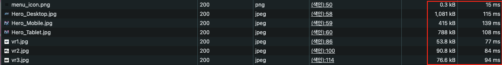
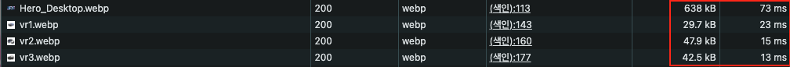
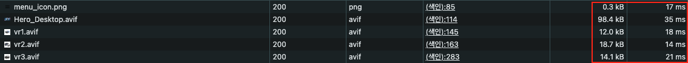
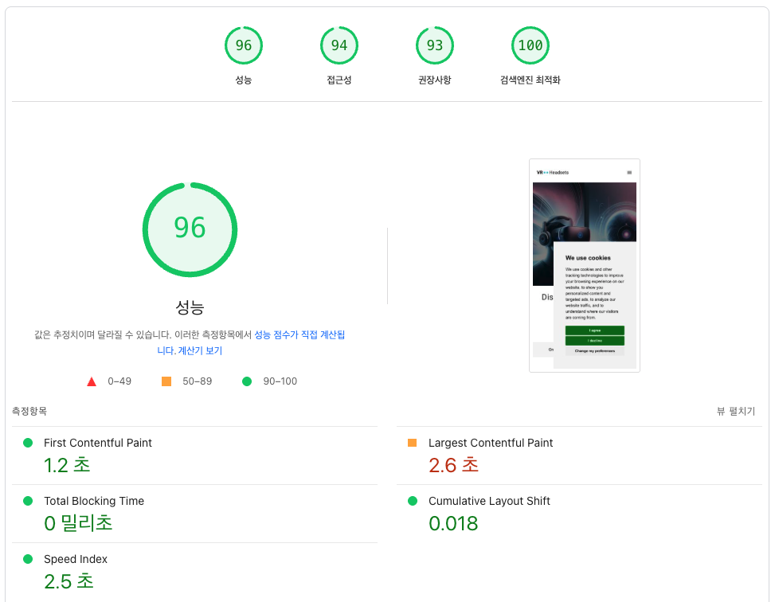

# Chapter 4-2. 코드 관점의 성능 최적화

## 목차

- [1. 학습 목표](#-1-학습-목표)
- [2. 링크](#-2-링크)
- [3. 주요 개념 정리](#-3-주요-개념-정리)
- [4. 초기 성능](#-4-초기-성능)
- [5. 성능 개선 과정 및 결과](#-5-성능-개선-과정-및-결과)
- [6. 학습 내용 정리](#-6-학습-내용-정리)
- [7. 과제 피드백](#-7-과제-피드백)

## 🎯 1. 학습 목표

🍦 바닐라 JavaScript 프로젝트를 구성/배포하고 성능 측정/개선을 진행합니다.

## 🔗 2. 링크

https://front-5th-chapter4-2-basic-neon.vercel.app/ ( Vercel 배포 )

## 📚 3. 주요 개념 정리

### ⚡️ Core Web Vitals

웹 사용자 경험(UX)의 핵심적인 품질 요소를 측정하기 위한 지표. Google이 제시했고 웹 페이지의 성능이 사용자의 실제 체감에 어떤 영향을 미치는지를 객관적으로 평가하는 데 목적이 있음

### 🕐 LCP (Largest Contentful Paint)

- 뷰포트 안에서 가장 큰 컨텐츠 요소가 렌더링되는 시간을 측정
- 주로 `img`, `video`, `h1`, `p` 등 큰 블록 요소
- 사용자가 페이지 로딩이 완료됐다고 느끼는 시점을 빠르게 제공하는 것이 목표
- 2.5초 이하의 성능을 보인다면 좋다고 평가받음

### 🎨 INP (Interaction to Next Paint)

- 사용자의 클릭, 탭, 키보드 입력 등 인터랙션 이후 화면이 실제로 반응하는 데 걸리는 시간
- 기존의 FID(First Input Delay)를 대체하는 최신 지표
- 측정 방식: 여러 입력들의 반응 시간을 측정에, 최악에 가까운 평균값을 사용.
- 200ms 이하면 좋다고 평가받음

### 🫨 CLS (Cumulative Layout Shift)

- 화면의 예상치 못한 레이아웃 이동 정도를 측정하는 지표
- 주요 원인
  - 이미지 크기 미지정
  - 웹폰트 FOUT(Flash of Unstyled Text)
  - 비동기 컨텐츠 삽입
- 점수 계산법: 이동된 요소의 비율 \* 이동 거리 비율 -> 누적 합계
- 0.1 이하면 좋다고 평가받음

### 🧠 요약

| 지표    | 목적        | 개선 방법 예시                                        |
| ------- | ----------- | ----------------------------------------------------- |
| **LCP** | 로딩 속도   | 이미지 최적화, 서버 응답 속도 개선, critical CSS 적용 |
| **INP** | 반응성      | JavaScript 최적화, main-thread blocking 줄이기        |
| **CLS** | 시각 안정성 | 이미지/비디오 크기 고정, 폰트 swap 처리               |

## 🛫 4. 초기 성능

### (1) lighthouse.yml 스크립트를 통한 검사

#### 🎯 Lighthouse 점수

| 카테고리       | 점수 | 상태 |
| -------------- | ---- | ---- |
| Performance    | 72%  | 🟠   |
| Accessibility  | 82%  | 🟠   |
| Best Practices | 75%  | 🟠   |
| SEO            | 82%  | 🟠   |
| PWA            | 0%   | 🔴   |

#### 📊 Core Web Vitals (2024)

| 메트릭 | 설명                      | 측정값 | 상태 |
| ------ | ------------------------- | ------ | ---- |
| LCP    | Largest Contentful Paint  | 14.56s | 🔴   |
| INP    | Interaction to Next Paint | N/A    | 🟢   |
| CLS    | Cumulative Layout Shift   | 0.011  | 🟢   |

### (2) 배포 링크를 통한 검사

#### 🎯 Lighthouse 점수


| 카테고리       | 점수 | 상태 |
| -------------- | ---- | ---- |
| Performance    | 69%  | 🟠   |
| Accessibility  | 82%  | 🟠   |
| Best Practices | 93%  | 🟢   |
| SEO            | 82%  | 🟠   |
| PWA            | 0%   | 🔴   |

❓❓ **Best Practices(권장사항) 값에서 lighthouse.yml로 검사한 것과 큰 차이를 보이는 이유는 뭘까??**

배포로 인해 발생하는 프로토콜, 보안 헤더, 브라우저 정책 등의 차이 때문인 것으로 보인다.

- 프로토콜 차이

  Best Practices 항목에서 HTTPS는 매우 중요한 평가 항목임.

- 보안 헤더 차이

  Vercel은 기본적으로 다음과 같은 보안 헤더들을 자동으로 설정하지만 `http-server`는 이런 것들을 제공하지 않음.

  - `X-Content-Type-Options: nosniff`
  - `X-Frame-Options: DENY`
  - `X-XSS-Protection: 1; mode=block`
  - `Referrer-Policy: origin-when-cross-origin`
  - `Strict-Transport-Security` (HSTS)

- Mixed Content 정책

  ```html
  <!-- index.html -->
  <script
    type="text/javascript"
    src="//www.freeprivacypolicy.com/public/cookie-consent/4.1.0/cookie-consent.js"
    charset="UTF-8"
  ></script>
  ```

  HTTP 환경에서는 이런 외부 스크립트들이 Mixed Content 이슈를 일으킬 수 있으나 HTTPS 환경에서는 보안 정책이 좀 더 엄격히 적용됨

- 서버 환경 차이

  - http-server: 단순한 정적 파일 서버, 최소한의 HTTP 헤더만 제공
  - Vercel: 엔터프라이즈급 CDN, 다양한 보안 최적화가 기본 적용되어있음

- 브라우저 정책 차이

  HTTPS 환경에서는 브라우저가 더 엄격한 보안 정책을 적용하며 이것이 긍정적으로 반영됨.

  - Service Worker 사용 가능
  - Secure Cookie 정책
  - CORS 정책 강화

#### 📊 PageSpeed Insights를 통한 Core Web Vitals (2024)


| 메트릭 | 설명                      | 측정값 | 상태 |
| ------ | ------------------------- | ------ | ---- |
| LCP    | Largest Contentful Paint  | 15.4s  | 🔴   |
| INP    | Interaction to Next Paint | N/A    | 🟢   |
| CLS    | Cumulative Layout Shift   | 0.01   | 🟢   |

### 개선 전 초기 성능 분석

#### 🚨 가장 심각한 문제

LCP 지표가 15초 안팎이며 일반적으로 2.5초 이내가 목표인데 거의 6배 정도가 느림

주요 원인

- Hero 이미지: `Hero_Desktop.jpg`, `Hero_Tablet.jpg`, `Hero_Mobile.jpg` 모두 동시에 로드하여 디바이스 별 적절한 이미지를 제공하고 있지 못함
- 이미지 최적화 부재: 압축되지 않은 원본 이미지 사용

#### ⚡️ Performance 점수 분석

**Javascript 실행 이슈**

```javascript
// products.js
for (let i = 0; i < 10000000; i++) {
  const temp = Math.sqrt(i) * Math.sqrt(i);
}
```

- 메인 스레드 블로킹: 불필요한 연산으로 인한 UI 렌더링 차단
- 동기식 API 호출: `fetch` 후 DOM 조작이 즉시 실행되어 렌더링이 지연됨

**렌더링 차단 리소스**

```html
<link
  href="https://fonts.googleapis.com/css?family=Heebo:300,400,600,700&display=swap"
  rel="stylesheet"
/>

<script>
  (function (w, d, s, l, i) {
    w[l] = w[l] || [];
    w[l].push({ "gtm.start": new Date().getTime(), event: "gtm.js" });
    var f = d.getElementsByTagName(s)[0],
      j = d.createElement(s),
      dl = l != "dataLayer" ? "&l=" + l : "";
    j.async = true;
    j.src = "https://www.googletagmanager.com/gtm.js?id=" + i + dl;
    f.parentNode.insertBefore(j, f);
  })(window, document, "script", "dataLayer", "GTM-PKK35GL5");
</script>

<script
  type="text/javascript"
  src="//www.freeprivacypolicy.com/public/cookie-consent/4.1.0/cookie-consent.js"
  charset="UTF-8"
></script>
```

- css 렌더링 블로킹
- script 태그의 동기적 실행으로 인한 블로킹

#### 📊 기타 점수 분석

**Accessibility**

- `alt` 속성이 없는 이미지가 많음
- 백그라운드/포그라운드 색상 대비가 불충분함

## 🔥 5. 성능 개선 과정 및 결과

### 🔨 성능 개선 과정

| 개선항목                                | 개선이유                           | 개선방법                            | 개선된 지표               |
| --------------------------------------- | ---------------------------------- | ----------------------------------- | ------------------------- |
| **Hero 이미지 반응형 최적화**           | 모든 환경의 이미지를 동시에 로드함 | picture 태그 사용                   | LCP, TBT 개선             |
| **이미지 포맷 변경 (jpg -> webp)**      | 이미지 요청 용량 개선              | jpg -> webp                         |
| **제품 이미지 Lazy Loading 적용**       | 초기 로딩 시간 단축                | img 요소에 `loading=lazy` 추가      |
| 이미지 요소에 alt 값 추가               | SEO, 접근성 지표 향상              | img 요소에 `alt` 추가               | SEO, 접근성 지표 개선     |
| main.js 최적화                          | 동일 요소 중복 참조                | 참조 요소 변수로 캐싱               | -                         |
| 폰트 최적화                             | 로딩 시간 단축                     | 폰트 자체 호스팅                    |
| **이미지 포맷 2차 변경 (webp -> avif)** | 이미지 요청 용량 개선              | webp -> avif                        |
| products.js 최적화                      | 무거운 연산 개선                   | 무거운 연산 개선                    |
| **index.html head 내 script 최적화**    | 초기 로딩 속도 개선                | 스크립트 지연 로딩                  |
| 이미지 너비, 높이 명시                  | CLS 지표 개선                      | img에 width, height 속성 추가       | Layout Shift 방지         |
| **메타 태그 추가**                      | SEO 지표 향상                      | index.html head 내에 meta 태그 추가 | SEO 지표 개선(100점 달성) |
| 포어/백그라운드 색상 대비율 최적화      | 접근성 지표 향상                   | 컬러 스타일 일부 수정               | 접근성 지표 개선          |

### 주요 성능 개선점

#### (1) 이미지 반응형 최적화

> 개요: 이미지는 크기가 큰 리소스이며 환경 별로 다른 사이즈의 이미지가 제공되어야함. 그러나 Desktop, Tablet, Mobile에서 쓰이는 이미지를 한 번에 로드하고 있었고 이는 로드 속도를 늦춰 사용자 경험에 큰 문제를 줌.

> 개선: `picture`, `source` 태그를 사용하여 환경 별로 다른 이미지를 노출하는 방식으로 개선.

as-is

```html


```

to-be

```html
<picture>
  <source
    class="mobile"
    media="(max-width: 576px)"
    srcset="images/Hero_Mobile.avif"
  />
  <source
    class="tablet"
    media="(max-width: 960px)"
    srcset="images/Hero_Tablet.avif"
  />
  
</picture>
```

#### (2) 이미지 포맷 변경 (jpg -> webp -> avif)





> 개요: webp, avif와 같은 최신 이미지 형식은 png, jpg에 비해 훨씬 높은 압축률을 제공함. 이로 인해 같은 품질이라도 파일 크기가 크게 줄어서 로드 속도가 빨라져서 좋은 사용자 경험을 제공할 수 있음.

> 개선: 이미지 포맷을 순차적으로 변경했고 용량과 로드 속도가 비약적으로 줄어듬

#### (3) 이미지 요소에 alt 값 추가

> 개요: `alt` 속성은 네트워크 환경이 좋지 않을 때나 이미지 로드 오류, 시각 장애인을 위한 스크린 리더 사용 등 다양한 이유로 이미지를 볼 수 없는 경우에 대체 정보를 제공함. 접근성과 SEO를 위해 필수적으로 지정해야하는 옵션.

> 개선: 이미지 요소에 `alt` 속성 값을 추가함.

as-is

```html

```

to-be

```html

```

#### (4) 제품 이미지 Lazy Loading 적용

> 개요: 화면에 바로 노출되지 않는 리소스의 경우 Lazy Loading을 적용하면 페이지 로드 시간을 줄이는데 도움이 됨. 이를 통해 좀 더 빠르게 페이지가 반응하는 느낌을 받을 수 있음.

> 개선: `img` 요소에 `loading="lazy"` 속성을 추가

as-is

```html

```

to-be

```html

```

#### (5) head 태그 내의 스크립트 최적화

> 개요: 페이지의 페인트를 차단하는 리소스는 좋지 않은 사용자 경험을 줌. 중요하지 않은 스크립트와 스타일을 지연 로드 함으로서 렌더링 블로킹 경험하지 않고 병렬적으로 로드하도록 개선

> 개선: 불필요한 스크립트 태그 주석 처리 및 defer 속성 추가로 병렬 로드

```html
<script
  defer
  type="text/javascript"
  src="//www.freeprivacypolicy.com/public/cookie-consent/4.1.0/cookie-consent.js"
  charset="UTF-8"
></script>
<script
  defer
  type="text/javascript"
  charset="UTF-8"
>
  document.addEventListener("DOMContentLoaded", function () {
    cookieconsent.run({
      notice_banner_type: "simple",
      consent_type: "express",
      palette: "light",
      language: "en",
      page_load_consent_levels: ["strictly-necessary"],
      notice_banner_reject_button_hide: false,
      preferences_center_close_button_hide: false,
      page_refresh_confirmation_buttons: false,
      website_name: "Performance Course",
    });
  });
</script>
```

#### (6) 메타 태그 추가

> 개요: `name="description"`을 가진 메타 태그는 검색 엔진이 검색 결과에 포함하는 페이지 컨텐츠의 요약 내용을 제공함.

> 개선: 메타 태그 추가, `name="description"` 과 `content` 속성에 값을 추가하여 메타 정보 제공.

```html
<meta
  name="description"
  content="Discover the latest VR headsets and accessories at Tech Shop. Explore our best sellers and subscribe to our newsletter for exclusive deals. with hanghaeplus fe"
/>
```

### 최종 결과

**🎯 Lighthouse 점수**
| 카테고리 | 점수 | 상태 |
|----------|------|------|
| Performance | 99% | 🟢 |
| Accessibility | 95% | 🟢 |
| Best Practices | 75% | 🟠 |
| SEO | 100% | 🟢 |
| PWA | 0% | 🔴 |

**📊 Core Web Vitals (2024)**
| 메트릭 | 설명 | 측정값 | 상태 |
|--------|------|--------|------|
| LCP | Largest Contentful Paint | 1.88s | 🟢 |
| INP | Interaction to Next Paint | N/A | 🟢 |
| CLS | Cumulative Layout Shift | 0.011 | 🟢 |

**🏎️ PageSpeed Insights**



## 🧹 6. 학습 내용 정리

### (1) 이미지 태그 별 차이

**요약 비교**

| 항목               | **JPG (JPEG)**     | **WebP**                           | **AVIF**                           |
| ------------------ | ------------------ | ---------------------------------- | ---------------------------------- |
| **출시년도**       | 1992               | 2010 (Google)                      | 2019 (Alliance for Open Media)     |
| **압축 방식**      | 손실 / 무손실      | 손실 / 무손실                      | 손실 / 무손실                      |
| **압축 효율**      | 보통               | 좋음 (JPG보다 약 30% 더 작음)      | 최고 (WebP보다 약 30\~50% 더 작음) |
| **화질 유지**      | 압축 시 화질 저하  | 비교적 안정적                      | 같은 용량에서 가장 나은 화질       |
| **애니메이션**     | ❌ 지원 안 함      | ✅ 지원                            | ✅ 지원                            |
| **투명도 (alpha)** | ❌ 지원 안 함      | ✅ 지원                            | ✅ 지원                            |
| **브라우저 지원**  | 거의 모든 브라우저 | Chrome, Firefox, Edge, Safari(14+) | Chrome, Firefox, Edge, Safari(16+) |
| **디코딩 속도**    | 빠름               | 빠름                               | 느림 (CPU 부담↑)                   |
| **파일 크기**      | 큼                 | 작음                               | 가장 작음                          |

**결론**

- jpg는 여전히 호환성 때문에 기본값으로 쓰이지만, 성능 면에서는 낡은 포맷.
- webp는 실용적인 선택지로, 대부분의 웹에서 안정적으로 사용됨.
- avif는 최고 수준의 압축 효율과 품질을 제공하지만, 디코딩 속도와 호환성에 주의가 필요.

### (2) link와 @import

#### ✅ 기본 개념

| 구분      | `link`                                     | `@import`                                       |
| --------- | ------------------------------------------ | ----------------------------------------------- |
| 정의      | HTML에서 외부 CSS를 불러오는 태그          | CSS 파일 내에서 다른 CSS 파일을 불러오는 규칙   |
| 사용 위치 | HTML `<head>` 태그 안                      | CSS 파일 내 최상단 또는 `<style>` 내부          |
| 문법      | `<link rel="stylesheet" href="style.css">` | `@import url("style.css");` 또는 `"style.css";` |

#### ⚒️ 브라우저 처리 방식

| 구분      | `link`                                     | `@import`                                               |
| --------- | ------------------------------------------ | ------------------------------------------------------- |
| 로딩 방식 | 병렬 로딩 (HTML 파싱 중에도 CSS 요청 가능) | 순차 로딩 (기존 CSS 파싱 후에야 `@import`된 CSS를 로딩) |
| 로딩 속도 | 빠름                                       | 느림                                                    |
| 지원 범위 | 모든 브라우저에서 잘 지원                  | 일부 구형 브라우저에서는 제한이 있을 수 있음            |

#### 🧐 link를 쓰면 렌더링 블로킹이 생기지 않을까?

아니다. link를 써도 렌더링 블로킹 현상은 생길 수 있음.

| 상황                                                                              | 렌더링 블로킹 여부 | 설명                                    |
| --------------------------------------------------------------------------------- | ------------------ | --------------------------------------- |
| `<link rel="stylesheet" href="style.css">`                                        | ✅ 블로킹          | CSS가 로드되기 전까지 렌더링을 멈춤     |
| `<link rel="preload" as="style" href="style.css" onload="this.rel='stylesheet'">` | ❌ 블로킹 X        | 비동기로 먼저 불러오고 후에 스타일 적용 |
| `media="print"`처럼 조건부 스타일                                                 | ❌ 블로킹 X        | 렌더링에 필요하지 않기 때문             |

### (3) defer과 async

- `defer`: HTML 파싱과 병렬로 JS 파일 다운로드, 파싱 완료 후 실행
- `async`: HTMl 파싱과 병렬로 JS 파일 다운로드, 다운로드 완료 시 즉시 실행 (파싱 일시 중단됨)

> ⚠️ `defer`는 일반적으로 순서가 중요한 메인 스크립트에 사용하며, `async`는 종속성이 없는 코드에만 권장함.

### (4) 색상 대비율

- 전경(텍스트 등)과 배경 사이의 시각적인 명도 차이를 수치로 표현한 것.
- 값의 범위는 1:1 (전혀 구분 불가) ~ **21:1 (최대 대비, 예: 검정-흰색)**

## 🔄 7. 과제 피드백

### (1) 😄 좋았던 점

일을 하다보면 일정에 치여서 성능 이슈가 수면 위로 떠오르기 전까지는 소홀한 경우가 많았습니다. 데스크탑/모바일에서 다른 크기의 이미지를 불러오는 리소스 최적화 정도는 해봤지만 직접 여러 지표들을 체크하면서 면밀히 살펴본 적은 없었습니다. 제가 주로 했던 일이 수 많은 트래픽이 몰리거나 SEO를 까다롭게 신경써야하는 그런 일이 아니어서 더 필요성을 느끼지 못했던 것 같기도 합니다.

또한 지금까지는 성능 최적화에 대해서 체계적으로 접근하지 않고 시각적으로 보이거나 체감되는 것들을 바탕으로 개선점을 찾곤 했었습니다. 하지만 이번 과제를 수행하며 제가 아는 것보다 성능에 영향을 주는 지표와 성능을 나타내는 지표에는 많은 것들이 있다는 것을 알게 되었고, 좀 더 체계적이고 과학적으로 성능이란 것을 이해하고 분석하여 최적화하는 경험을 얻게 되었습니다. 성능 최적화가 막연하고 추상적인 게 아니라 물리적으로 실재하는 것처럼 와닿아서 제게 가장 큰 소득이 있었던 챕터라고 생각합니다.

### (2) 😔 아쉬운 점

없습니다. 성능 최적화 파트를 기다렸고 많은 것을 배우기를 고대했고 여기저기서 얼레벌레 주워 담아서 머리 속에서 산재된 지식들을 정리하고 실제로 경험할 수 있어서 좋았습니다. 좀 더 실전적인 것은 제가 스스로 해나가야할 문제인 것 같고 그런 배경을 만들 수 있는 과제여서 아쉬운 것은 없습니다.
